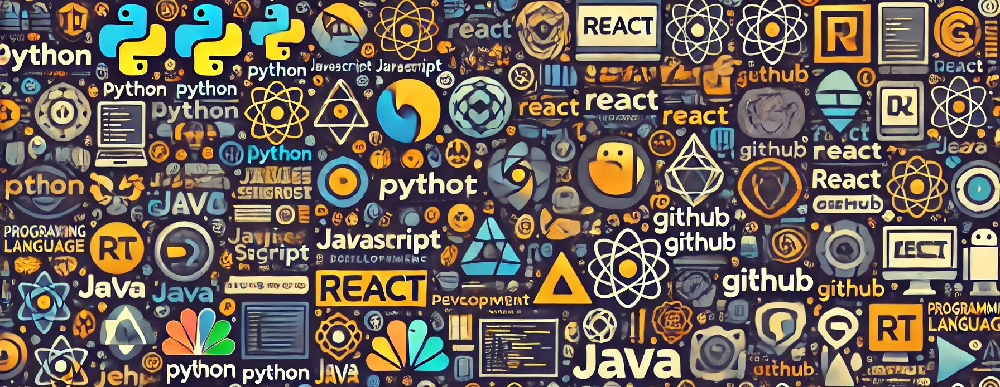

<!--- ------------------------------------------------------------------------------------------------------------------------------------------------------ .-->
<!--- -- Custom Designed Banner ---------------------------------------------------------------------------------------------------------------------------- -->
<!--- ------------------------------------------------------------------------------------------------------------------------------------------------------ -->

 

# Hi, I'm Prathamesh 👋
### Python Developer in the Making | CSE PreFinal Year | Tech Innovator at Heart
<!--- ------------------------------------------------------------------------------------------------------------------------------------------------------ -->
<!--- -- Visitor Badge + Links ----------------------------------------------------------------------------------------------------------------------------- -->
<!--- ------------------------------------------------------------------------------------------------------------------------------------------------------ -->

    
      

  
  
  
    

 

<!--- ------------------------------------------------------------------------------------------------------------------------------------------------------ -->
<!--- -- About ME  --------------------------------------------------------------------------------------------------------------------------------------- -->
<!--- ------------------------------------------------------------------------------------------------------------------------------------------------------ -->
 
 </a>
 

"My name is Prathamesh, a name that signifies 'one illuminated by the sun.' I aim to build a career alongside dedicated, driven individuals who inspire me to unlock my full potential. I am eager to contribute as a key player in a dynamic and innovative environment, where I can apply and expand my professional and technical skills to make a meaningful impact."

### 
My Technical Skills

  

  

<i>&nbsp; Work with Optimism, Hope for the Best!</i>  

👋 Greetings! It's great to have you here. I'm Prathamesh , an upcoming enthusiastic Software Engineer hailing from India..

🎓 &nbsp; I'm pursuing Bachelor of Technology with a degree in Computer Engineer.

🔥 &nbsp; With an impressive following of 1k+ on [Linkedin](https://www.linkedin.com/in/prathamesh-atkare-6223aa255/).

🔖 &nbsp; I am busy in DSA and Developement on use cases across various industries and technologies.

😄 &nbsp; My standout strength lies in my unwavering adaptability—a dynamic force that transforms challenges into opportunities. Coupled with a relentless passion for continuous learning, I thrive in pushing boundaries, embracing innovation, and consistently delivering results that exceed expectations. 

🎁 Empathy is my compass—guiding collaboration, fostering understanding, and creating a harmonious tapestry in every interaction.

<!--  

  
🏆 Certificates

   

📄 Below is a showcase of my knowledge and skills across a wide range of Competitive Programming and Development.
 

| S.No. | Achievement Name           | Issuing Authority |       Date        | Details                                                                                                                                                                       | Credential |
| :---: | :------------------------- | :---------------: | :---------------: | :---------------------------------------------------------------------------------------------------------------------------------------------------------------------------- | :--------- |
|  1.   | GSSOC’24                   |   GSSOC’24 EXT    | Oct '24 - Present | ctively contributing to open-source projects (65 PRs accepted), showcasing development and practical experience. Rank 1 in GSSOC’24 EXT.                                      | [View]()   |
|  2.   | Coding World Cup           |   Coding Ninjas   |      Nov'23       | Attained an All-India Rank of 106 by effectively tackling all coding challenges, highlighting strong competitive programming and algorithmic proficiency.                     | [View]()   |
|  3.   | College Coding Competition | Kaun Banega Coder |      Dec'24       | Secured 1st place by flawlessly solving all 5 advanced coding challenges in a timed competition, showcasing top-tier competitive programming skills against 50+ participants. | [View]()   |
|  4.   | Hi-Tech                    |     Code-War      |      Mar'24       | Secured 3rd place by successfully tackling 2 out of 3 coding problems, highlighting competitive programming skills.                                                           | [View]()   |

  

  -->
 

<!------------------   -------------------------------------------------------------------- -->
<!---------------- Recommend Blog Post ----------------------------------------------------- -->
<!---------------------  ------------------------------------------------------------------- -->

<!------------------   -------------------------------------------------------------------- -->
<!----------------[END] Recommend Blog Post ----------------------------------------------------- -->
<!---------------------  ------------------------------------------------------------------- -->

<samp>Trying to touch and learn 1 new thing everyday!</samp>
---

# Tech Stack 

| <samp>Tools & Technologies</samp>  | <samp>Badge</samp>                                                                                                                                                                                                                                                                                                                                                                                                                                                                                                                                                                    |
| ---------------------------------- | ------------------------------------------------------------------------------------------------------------------------------------------------------------------------------------------------------------------------------------------------------------------------------------------------------------------------------------------------------------------------------------------------------------------------------------------------------------------------------------------------------------------------------------------------------------------------------------- |
| <samp>Programming Languages</samp> |    |
| <samp>Frameworks</samp>            | !                                                                                                                                                                                                                                                                                                                                                |
| <samp>IDE & Environment</samp>     |                                                                                                  |
| <samp>Version Control</samp>       |                                                                                                                                                                                                                                                                                                                                                                        |
| <samp>Databases</samp>             |                                                                                                                              |
| <samp>Cloud Platforms</samp>       |                                                                                                                              |
| <samp>Operating System</samp>      |                                                           |

 

<!--- ------------------------------------------------------------------------------------------------------------------------------------------------------ -->
<!--- -- Activity Graph ------------------------------------------------------------------------------------------------------------------------------------ -->
<!--- ------------------------------------------------------------------------------------------------------------------------------------------------------ -->

 

                     
 

<!--- ------------------------------------------------------------------------------------------------------------------------------------------------------ -->
<!--- -- My Socials ---------------------------------------------------------------------------------------------------------------------------------------- -->
<!--- ------------------------------------------------------------------------------------------------------------------------------------------------------ -->

 

# Github Stats

<!-- ---------------------------------------STATS------------------------------------------
--------------------------------------------------------------------------------------------- -->

   

  
  
  
  
  

### 🔝 Top Contributed Repo

  

### ✍ Random Dev Quote

  

